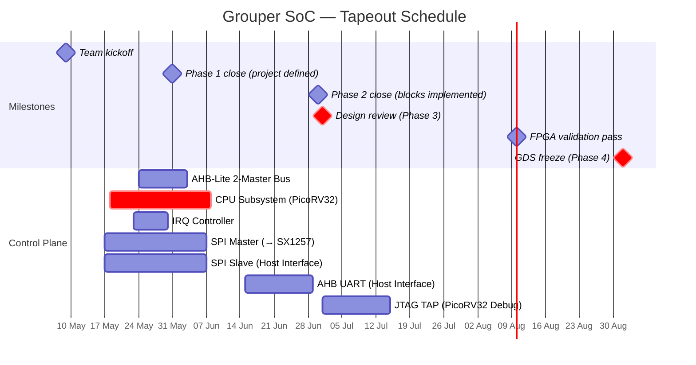

# Project Schedule

Tapeout deadline: **1 September 2026**. Design review: **July 2026**. Today: **17 May 2026**.

See [Chipathon 2026](Chipathon%202026.md) for official phase definitions.

---

---

