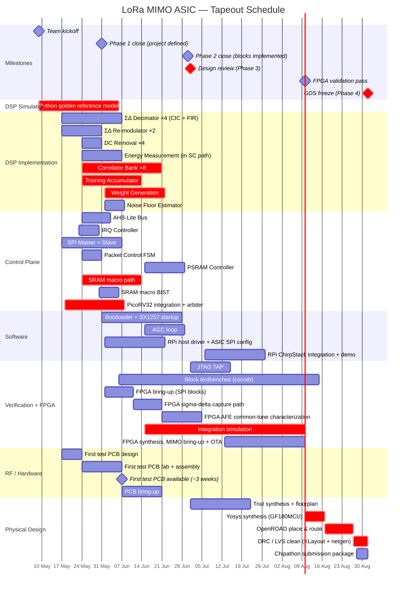

# Project Schedule

Tapeout deadline: **1 September 2026**. Design review: **July 2026**. Today: **17 May 2026**.

See [Chipathon 2026](Chipathon%202026.md) for official phase definitions.

---

---

## Critical path

The chain that determines whether September 1 is achievable:

1. **Correlator Bank RTL** (May 9 → Jun 6) — 8 coherent integrators; determines lock quality and timing handoff
2. **Training Accumulator + Weight Generation RTL** (May 17 → Jun 15) — replaces the old FFT/ALMMSE path and is now the main packet-training critical path
3. **SRAM macro path / GF180 enablement** (May 9 → May 30) — SRAM selection and integration must settle early because the DSP and CPU paths both depend on it
4. **PicoRV32 integration** (May 18 → Jun 8) — needs SRAM and bus; firmware and control-plane integration can't be exercised until this is done
5. **Integration simulation** (Jun 15 → Aug 10) — first full-system connection of DSP, control, and firmware paths; expect debug iterations here
6. **FPGA AFE characterization + OTA test** (Jun 21 → Aug 10) — FPGA first validates sigma-delta capture and AFE coherence, then later validates NT=1 + NT=2 before GDS
7. **OpenROAD P&R → DRC/LVS** (Aug 17 → Sep 1) — 2.5 weeks; no float

Trial synthesis runs from Jul 1 to catch area/timing surprises while RTL is still in flux. Final P&R begins Aug 17 once RTL is frozen. FPGA MIMO / OTA test and final P&R overlap deliberately (Aug 10–17) — if FPGA finds an RTL bug after Aug 17, P&R must restart. Keep FPGA scope staged: first SPI + sigma-delta capture + AFE coherence work, then packet RX, MIMO combining, and IRQ.

---

## Float / risk

| Risk | Float | Mitigation |
| --- | --- | --- |
| Training accumulator / weight path runs late | 1 week | Start cocotb testbench in parallel with RTL and validate against the Python chain early |
| SRAM macro path unresolved on GF180MCU | 0 days (critical path) | Treat SRAM enablement as a first-class task; evaluate OpenRAM support, alternative SRAM generators, compiler macros, or split behavioural/placeholder SRAM path early |
| Correlator bank coherence issues | 3 days | Validate with Python golden model before RTL; test each correlator independently |
| PSRAM controller integration churn | 3 days | Keep replay mode optional and stage bring-up after the live path is stable |
| Phase coherence across SX1257s 2–4 | TBD | Use FPGA sigma-delta capture plus common-tone AFE tests before full OTA work |
| DRC violations in P&R | 3 days | GF180MCU standard cells only; let OpenROAD handle fill |
| Chipathon shuttle deadline shifts | — | Monitor SSCS announcements; July design review gives early warning |
