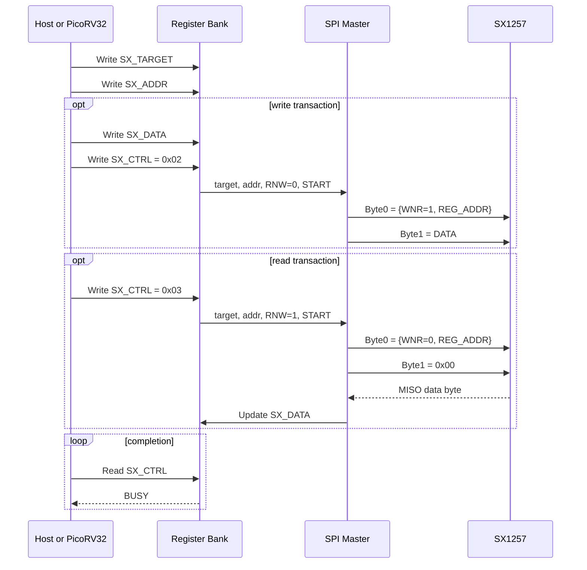

# SPI Master (→ SX1257)

Control block. See [System Architecture](../System%20Diagram.md) for context.

**Owner:** TBD
**Status:** Not started

---

## Function

SPI master driven by PicoRV32 via AHB-Lite and exposed to the host through the `SX_TARGET` / `SX_ADDR` / `SX_DATA` / `SX_CTRL` pass-through registers. It issues SX1257 single-register transactions for all four radios: frequency, gain, mode, filter, and diagnostic reads. One shared MOSI/MISO/SCK bus is used for all devices; device selection is via a 2-bit address output (`CS_A[1:0]`) driving a board-level 74HC139 2-to-4 decoder that generates the individual active-low SX1257 NSS lines.

In addition to pass-through use by the host or PicoRV32, this block is also used internally by the RX gain-control sequencer to apply queued `RX_GAIN_COMMIT` updates at packet-safe boundaries.

---

## Interface

| Port | Direction | Width | Description |
| --- | --- | --- | --- |
| `hsel` | in | 1 | AHB-Lite subordinate select |
| `haddr` | in | 8 | AHB-Lite byte address (lower 8 bits used for register select) |
| `htrans` | in | 2 | AHB-Lite transfer type (IDLE=`2'b00`, NONSEQ=`2'b10`) |
| `hwrite` | in | 1 | AHB-Lite transfer direction (1=write, 0=read) |
| `hwdata` | in | 32 | AHB-Lite write data |
| `hrdata` | out | 32 | AHB-Lite read data |
| `hready` | in | 1 | AHB-Lite ready in (previous subordinate done) |
| `hreadyout` | out | 1 | AHB-Lite ready out (this subordinate done) |
| `hresp` | out | 1 | AHB-Lite error response (tied `1'b0` — no error) |
| `clk_32m` | in | — | Master clock (`HCLK`) |
| `rst_n` | in | — | Active-low reset (`HRESETn`) |
| `SPI_SCK` | out | 1 | Clock to SX1257 (default 4 MHz = 32 MHz÷8; max 10 MHz) |
| `SPI_MOSI` | out | 1 | Data to SX1257 |
| `SPI_MISO` | in | 1 | Data from SX1257 |
| `CS_A[1:0]` | out | 2 | Device address to board-level 74HC139 decoder → SX1257_1–4 NSS |
| `busy` | out | 1 | High while SPI transaction in progress |

---

## Protocol

SX1257 SPI: Mode 0, MSB first, up to 10 MHz.

Wire format:

```text
Byte 0: [7] WNR  [6:0] REG_ADDR
Byte 1: DATA / DUMMY
```

Where:

- `WNR = 1` means SX1257 write
- `WNR = 0` means SX1257 read

Equivalent 16-bit view:

```text
[15] WNR, [14:8] REG_ADDR, [7:0] DATA / DUMMY
```

Firmware writes:
```c
// Write to SX1257_n register addr with value data:
spi_master_write(n, addr, data);
// Expands to: set CS_A = n, assert transaction, shift {1'b1, addr[6:0], data[7:0]}, deassert
```

Firmware reads:
```c
// Read register addr from SX1257_n:
data = spi_master_read(n, addr);
// Expands to: set CS_A = n, assert transaction, shift {1'b0, addr[6:0], 8'h00}, capture MISO byte, deassert
```

`CS_A[1:0]` must be stable before the first SCK edge. The block holds `CS_A` at the selected value for the full transaction duration, then returns it to a defined idle state (e.g. `00`) after deassert. A quiescent SCK ensures no unintended SX1257 latches data while `CS_A` changes between transactions.

SX1257 register writes used during operation:
- `RegMode` (0x00) — RX/TX mode switching (e.g. `0x03` = RX, `0x0D` = TX+PA, `0x01` = standby)
- `RegFrfRxMsb/Mid/Lsb` (0x01–0x03) — RX PLL frequency
- `RegFrfTxMsb/Mid/Lsb` (0x04–0x06) — TX PLL frequency
- `RegRxAnaGain` (0x0C) — AGC gain setting
- `RegTxGain` (0x08) — TX DAC and mixer gain

Reference-clock note for SX1257 register programming:

- the planned board reference is `32 MHz`, not `36 MHz`
- this is not a separate SX1257 PLL mode bit; the PLL uses whatever reference is physically driven into `XTB`
- frequency-programming words written into `RegFrfRxMsb/Mid/Lsb` and `RegFrfTxMsb/Mid/Lsb` must therefore be calculated for `F_XOSC = 32 MHz`
- `RegRxBw[4:2]` (`RxAdcTrim`) must be set for the `32 MHz` reference case: `110` for `32 MHz`, not the `36 MHz` setting `101`
- when using the shared external TCXO on `XTB`, `XTA` is left open and the `XTB` input amplitude must remain within the datasheet limit (`1.8 Vpp` max)

---

## Pass-through mode

When the host or PicoRV32 writes `SX_CTRL[1]=1` (START), the SPI master issues one SX1257 single-register transaction using `SX_TARGET`, `SX_ADDR`, `SX_DATA`, and `SX_CTRL` from the register bank.

Programmer-visible fields:

- `SX_TARGET[1:0]` selects the SX1257 device
- `SX_ADDR[6:0]` selects the SX1257 register
- `SX_CTRL[0]` is the programmer-facing `RNW` bit from the register map: `1=read`, `0=write`
- `SX_DATA[7:0]` is the write payload for writes and ignored for reads

Internal translation to the SX1257 wire bit:

```text
SX_CTRL.RNW = 0  -> SX1257 WNR = 1   // write
SX_CTRL.RNW = 1  -> SX1257 WNR = 0   // read
```

`CS_A[1:0]` is driven from `SX_TARGET[1:0]` (bits [3:2] ignored). `BUSY` is asserted from transaction launch until the final SCK edge and chip-select release. On a read transaction, `SX_DATA` is overwritten with the returned MISO byte when the transaction completes. Firmware and host software must not initiate a new transaction while `BUSY` is high.

See [Register Map](../Register%20Map.md) `0xB5`–`0xB8` for the full protocol and typical init register list.

For clarity during bring-up, any documented SX1257 init script should explicitly note that the system reference is `32 MHz`. Do not reuse `36 MHz` FRF constants or `36 MHz` `RxAdcTrim` values from older examples without recomputing them.

Programmer-visible sequence:

```text
Write path:
1. Write SX_TARGET
2. Write SX_ADDR
3. Write SX_DATA
4. Write SX_CTRL = 0x02   // START=1, RNW=0 (write)
5. Poll  SX_CTRL[2] until BUSY=0

Read path:
1. Write SX_TARGET
2. Write SX_ADDR
3. Write SX_CTRL = 0x03   // START=1, RNW=1 (read)
4. Poll  SX_CTRL[2] until BUSY=0
5. Read  SX_DATA
```



### Timing diagram

The ASIC-to-SX1257 bus timing is captured in [spi-master-timing.svg](../assets/spi-master-timing.svg).


The SVG shows one SX1257 read transaction after software has already programmed `SX_TARGET`, `SX_ADDR`, and `SX_CTRL`. For a write transaction, `SPI_MOSI` byte 1 carries the write data instead of `0x00`, and `SPI_MISO` is ignored. `SX1257_NSS[n]` must assert only after `CS_A[1:0]` is stable, and `SPI_SCK` must remain quiescent while `CS_A[1:0]` changes between targets.

---

## Implementation notes

**SCK divider.** Divide 32 MHz by 8 = 4 MHz SCK (half-period 125 ns). This gives 65 ns margin on the SX1257 MOSI hold time requirement (t_hold = 60 ns min). Do not use /4 (8 MHz) as the default: at 8 MHz the half-period is only 62.5 ns, leaving 2.5 ns of hold-time margin which is insufficient once flip-flop clock-to-output delay is included. Expose the divider as a parameter with /8 as the reset default and /4 as the documented minimum.

**Shared bus / bus conflict.** `SPI_MOSI`, `SPI_MISO`, `SPI_SCK` are shared with the SPI slave (host interface). The SPI master drives MOSI/SCK only during an active transaction (SCK toggling). The SPI slave tristates MISO when `HOST_CS` is not asserted. No additional arbitration needed if firmware never initiates an SX1257 transaction during a host SPI access. `CS_A` is an ASIC output only — the host has no visibility of it.

**MISO capture.** Latch `SPI_MISO` on the rising edge of SCK. SX1257 read responses used only for diagnostic register verification — not in the normal operating path.

**Clock domain.** This block is fully synchronous — SCK is generated by dividing `clk_32m`, so MOSI, SCK, and CS are all in the 32 MHz domain. No CDC required on the SPI master itself. However, if any SX1257 DIO output pins (`pll_lock_rx`, `pll_lock_tx`) are routed back as pad inputs, each requires a 2-FF synchroniser before use in the 32 MHz domain. Alternatively, poll PLL lock by reading `RegModeStatus` (0x11) over this SPI bus — in that case no DIO pads or synchronisers are needed.

**AHB-Lite interface.** This block is a minimal AHB-Lite subordinate. It decodes `hsel & htrans[1]` to qualify transfers (ignoring `IDLE` and `BUSY`). `hreadyout` is asserted the cycle after a valid access; `hresp` is permanently `0`. The SPI master is not itself an AHB-Lite initiator. See [AHB-Lite Bus](AHB-Lite%20Bus.md) for the interconnect.

**No burst mode required.** Although SX1257 supports burst SPI access with auto-incremented register addresses, this block only needs single-register 2-byte transactions for the current control software path. A future burst extension can be added if startup programming time becomes a concern.

**RX gain apply path.** When `RX_GAIN_COMMIT` is pending, an internal gain-control sequencer takes temporary ownership of this SPI master during `Packet Control FSM IDLE` and issues four writes to `RegRxAnaGain (0x0C)`, one per SX1257. Software-visible `BUSY` behaviour for pass-through transactions is unchanged: host and firmware must still avoid issuing pass-through commands while `BUSY=1`. If the four-write sequence does not complete, the gain-control block leaves `RX_GAIN_ACTIVE_n` unchanged and reports the failure through `RX_GAIN_CTRL.RX_GAIN_ERROR`.

---

## Verification

| Test | Method | Pass criterion |
| --- | --- | --- |
| Single register write | cocotb: trigger write, capture MOSI/SCK/CS_A | Correct 16-bit sequence; CS_A stable at correct value throughout |
| All 4 devices | Write to each SX1257 (cs_a = 0,1,2,3) | CS_A matches target; SCK quiescent between transactions |
| CS_A stability | Change cs_a; verify SCK stays low during address change | No SCK edges while CS_A transitions |
| Back-to-back writes | Two writes with no gap | CS_A updated before second SCK; no spurious toggle between |
| MISO capture | Drive known value on MISO | Readback data latched correctly |
| Busy flag | Poll during transaction | `busy` high during SCK cycles; low after transaction completes |
| Pass-through (SX_CTRL) | Host issues read via SX_CTRL | CS_A driven from SX_TARGET[1:0]; MISO captured to SX_DATA |

---

## Related blocks

- [PicoRV32 Integration](PicoRV32%20Integration.md) — AHB-Lite master driving this block
- [AHB-Lite Bus](AHB-Lite%20Bus.md) — interconnect
- [System Architecture](../System%20Diagram.md) — SPI bus topology and shared signal details
