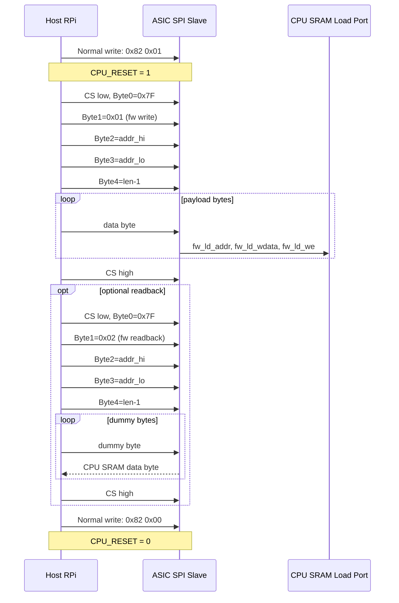

# SPI Slave (Host Interface)

Control block. See [System Architecture](../System%20Diagram.md) for context.

**Owner:** TBD
**Status:** Not started

---

## Function

SPI slave providing the RPi (SPI0 CS1) with:

- byte-wide register read/write access to the ASIC configuration and status register bank
- firmware load access into the PicoRV32 unified 4 kB CPU SRAM at `0x0000`–`0x0FFF`

> **Non-FFT path:** The FFT-era burst SRAM read feature is removed from the active architecture. This block does **not** need any interface to the legacy 544 kB Baseband SRAM. The active requirements are register access plus firmware load into CPU SRAM only.
>
> **Bus scope:** This block is **not** a general AHB-Lite bridge or bus master. Host SPI accesses terminate either in the register bank (`reg_*`) or in the dedicated CPU SRAM firmware-load / readback path (`fw_ld_*`). Arbitrary host peek/poke of the internal AHB-Lite address space is out of scope.

---

## Interface

| Port | Direction | Width | Description |
| --- | --- | --- | --- |
| `HOST_CS` | in | 1 | Active-low chip select from RPi SPI0 CS1 |
| `SPI_SCK` | in | 1 | SPI clock from RPi (up to 10 MHz) |
| `SPI_MOSI` | in | 1 | Data from RPi |
| `SPI_MISO` | out | 1 | Data to RPi |
| `clk_32m` | in | — | Master clock (register domain) |
| `rst_n` | in | — | Active-low reset |
| `reg_addr` | out | 8 | Decoded register address |
| `reg_wdata` | out | 8 | Write data |
| `reg_we` | out | 1 | Write enable to register bank |
| `reg_rdata` | in | 8 | Read data from register bank |
| `fw_ld_addr` | out | 12 | Byte address into unified CPU SRAM (`0x000`–`0xFFF`) |
| `fw_ld_wdata` | out | 8 | Firmware-load write data byte |
| `fw_ld_we` | out | 1 | Firmware-load write strobe |
| `fw_ld_rdata` | in | 8 | Optional firmware-readback byte for debug / verification |
| `fw_ld_req` | out | 1 | Firmware-load request |
| `fw_ld_ready` | in | 1 | Firmware-load port ready / accepted |

---

## Protocol

**SPI mode:** Mode 0 (CPOL=0, CPHA=0). MSB first.

### Single register access (2 bytes)

```
Byte 0: [7] R/W̄  [6:0] address
Byte 1: data (write) or don't-care (read)
MISO byte 1: register contents (read) or 0x00 (write)
```

Rules:

- Every normal register transaction is exactly 2 bytes under one `HOST_CS` assertion.
- If Byte 0 is anything other than `0x7F`, the slave interprets the transaction as a normal 2-byte register access.
- Address value `0x7F` is reserved as an extended-command escape and must not be assigned to a normal register.
- The active register set for tapeout is the register map in [Register Map](../Register%20Map.md).

### Extended command escape

If Byte 0 is `0x7F`, the SPI slave does **not** treat it as a register address. Instead, `0x7F` is the command escape byte that tells the parser to enter extended-command mode:

```
Byte 0: 0x7F                // escape
Byte 1: opcode
Byte 2: addr_hi[3:0]        // start address bits [11:8] in low nibble; high nibble = 0
Byte 3: addr_lo[7:0]        // start address bits [7:0]
Byte 4: len_minus_1         // transfer length = 1..256 bytes
Byte 5...: payload or dummy bytes depending on opcode
```

Parser rule:

```text
Byte 0 != 0x7F  -> normal 2-byte register transaction
Byte 0 == 0x7F  -> extended-command transaction
```

`HOST_CS` must remain asserted for the entire extended command. If `HOST_CS` deasserts before the declared payload length completes, the command is aborted and any partial final byte is discarded.

### Extended opcode `0x01` — firmware load write

```
Byte 0: 0x7F
Byte 1: 0x01
Byte 2: addr_hi
Byte 3: addr_lo
Byte 4: len_minus_1
Bytes 5...(5+N-1): payload bytes written to CPU SRAM, starting at the specified start address and auto-incrementing after each byte
```

Semantics:

- Valid address range is `0x000`–`0xFFF` only.
- The slave auto-increments `fw_ld_addr` after each accepted byte.
- Writes beyond `0x0FFF` are ignored once the address reaches the top of the 4 kB CPU SRAM window.
- Firmware writes are only permitted while `CPU_RESET[0] = 1`. Host software must assert `CPU_RESET` before issuing this command.
- MISO returns `0x00` for all bytes of a write command.
- The write command does not return an explicit success / fail status. The host confirms success by issuing opcode `0x02` readback for the same start address and length, then comparing returned bytes against the payload.

### Extended opcode `0x02` — firmware readback

Optional but recommended for bring-up and cocotb verification.

```
Byte 0: 0x7F
Byte 1: 0x02
Byte 2: addr_hi
Byte 3: addr_lo
Byte 4: len_minus_1
Bytes 5...(5+N-1): host sends dummy bytes; MISO returns CPU SRAM bytes, starting at the specified start address and auto-incrementing after each byte
```

Semantics:

- Readback uses the same `0x000`–`0xFFF` byte-address window and auto-increment rule as write.
- MISO during bytes 0–4 is `0x00`.
- Returned data begins on byte 5.

### Boot sequence

`CPU_RESET` is a normal register write to address `0x02`, not an extended command.

Examples:

```text
Assert CPU reset:   0x82 0x01   // write register 0x02 = 0x01
Release CPU reset:  0x82 0x00   // write register 0x02 = 0x00
```

```
1. Host writes CPU_RESET = 1 via register 0x02
2. Host issues one or more extended opcode 0x01 firmware-load writes starting at address 0x000
3. Host optionally verifies contents with extended opcode 0x02
4. Host writes CPU_RESET = 0 via register 0x02
5. PicoRV32 fetches from 0x00000
```

### Mermaid transaction flow




`HOST_CS` must stay asserted for the full header (5 bytes) plus all payload bytes. `fw_ld_we` pulses once per accepted byte; `fw_ld_addr` auto-increments. `MISO=0x00` throughout. If `HOST_CS` deasserts early, the command is aborted and any partial trailing byte is discarded.

---

## Implementation notes

**Clock domain crossing.** SPI clock (up to 10 MHz) and 32 MHz system clock are asynchronous. Run the SPI shifter and frame parser in the SPI clock domain, then cross completed register operations and firmware-load bytes into `clk_32m` with a small handshake or async FIFO. Do not try to edge-detect `SPI_SCK` directly inside the 32 MHz domain.

**MISO tristate.** Drive `SPI_MISO` only when `HOST_CS` is asserted. Tristate (or drive low) otherwise — the line is shared with the ASIC's SPI master output via the shared SPI bus.

**Bus conflict.** `HOST_CS` and `SX1257_CS[3:0]` are mutually exclusive by design (RPi and PicoRV32 never assert simultaneously). No explicit arbitration needed if firmware protocol is respected.

**Register bank.** Thin address decoder maps `reg_addr` to the register file. Writable registers latch `reg_wdata` on `reg_we`. Read-only registers ignore `reg_we`.

**Firmware-load datapath.** The firmware-load port is byte-oriented at the SPI slave boundary. The downstream CPU SRAM wrapper may pack these writes into 32-bit macro writes internally, but that packing is not visible on the host SPI interface.

**Throughput.** At 10 MHz SPI, one payload byte arrives every 0.8 us. The firmware-load sink only needs to sustain 1.25 MB/s peak. A one-byte ready/accept handshake is sufficient; no DMA is required.

**Command decoding.** Normal 2-byte register frames and extended `0x7F` frames are distinct protocol classes. The parser must commit to one class from Byte 0 and must not reinterpret a partially received extended frame as a register access.

---

## Verification

| Test | Method | Pass criterion |
| --- | --- | --- |
| CHIP_ID read | cocotb SPI master; read 0x00 | Returns 0xA7 |
| Register write + readback | Write known pattern to all R/W registers; read back | Byte-identical readback |
| Read-only register write | Write to CHIP_ID; read back | Still returns 0xA7 |
| Extended-command decode | Send `0x7F` frame with opcode `0x01` and `0x02` | Correct command selected; normal register path not triggered |
| Firmware load write | Write 256-byte binary with opcode `0x01` starting at `0x000` | `fw_ld_addr` auto-increments; contents match expected bytes |
| Firmware readback | Preload CPU SRAM; read with opcode `0x02` | MISO returns byte-identical contents starting on byte 5 |
| CPU_RESET sequence | Assert, load, de-assert; monitor PicoRV32 fetch | CPU starts fetching from `0x00000` |
| Early-CS abort | Deassert `HOST_CS` mid-extended command | Partial trailing byte discarded; next transaction starts cleanly |
| Back-to-back transactions | Multiple single-byte accesses | No missed edges; correct data each transaction |

---

## Related blocks

- [Register Map](../Register%20Map.md) — authoritative active register set for tapeout
- [PicoRV32 Integration](PicoRV32%20Integration.md) — unified 4 kB CPU SRAM target for firmware load; `CPU_RESET` register
- [AHB-Lite Bus](AHB-Lite%20Bus.md) — internal bus for register access
