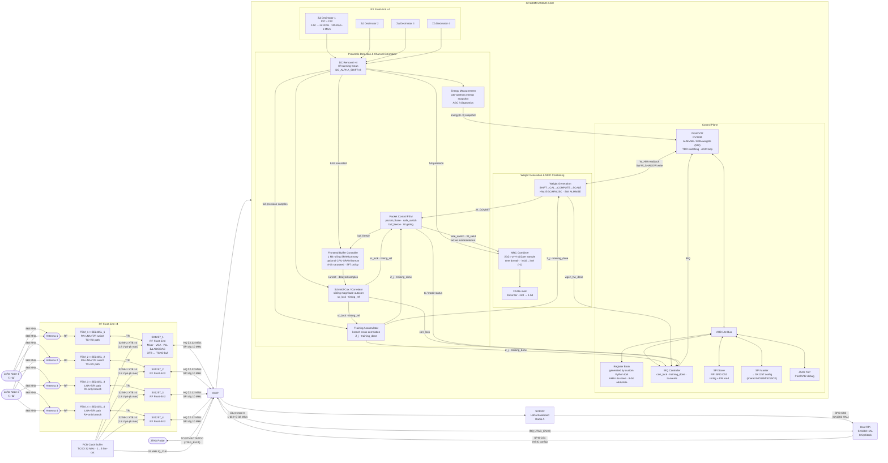

# System Architecture & Block Overview

> Architecture — NT=1 NR=4 MRC single-mode MIMO gateway ASIC.
> GF180MCU. 3.3 V core and IO. SSCS PICO Chipathon 2026. Tapeout deadline: September 2026.

Related prototype hardware note: [AFE Characterisation Board](AFE%20Characterisation%20Board.md)

Full pad list: [Pinout](Pinout.md)

Deployment configurations (cascaded ASIC topology for NR>4): [Applications](Applications.md)

---

## System Architecture



Notes:

- `FEM` = front-end module. Here it means the external `SE2435L` RF front-end on each antenna branch.
- `Energy Measurement` is shown explicitly because it shares the preamble-detection path but also provides the per-antenna snapshot used by AGC and diagnostics.

---

## Interfaces

| Interface | From | To | Signal | Rate |
| --- | --- | --- | --- | --- |
| RX I/Q ×4 | SX1257_1–4 ΣΔ ADC | ASIC decimators | 1-bit I+Q sigma-delta | 32 MS/s per antenna |
| RX CLK | PCB Clock Buffer | ASIC (shared) | 32 MHz clock | — |
| SPI config | ASIC SPI master | SX1257_1–4 | RegMode, freq, gain | 10 MHz |
| ΣΔ re-mod A | ASIC | SX1302 Radio A | 1-bit I+Q sigma-delta | 32 MS/s |
| Host SPI | RPi SPI0 CS1 | ASIC SPI slave | Config registers + FW load | 10 MHz |
| SX1302 SPI | RPi SPI0 CS0 | SX1302 | SX1302 HAL (packets, config) | 10 MHz |
| IRQ | ASIC | RPi GPIO | Packet ready, error | GPIO |
| JTAG | JTAG probe | ASIC JTAG TAP | TCK + TMS + TDI + TDO | — |

### SX1257 → ASIC (RX, per antenna)

| Signal | Direction | Description |
| --- | --- | --- |
| `IQ_DATA_I[n]` | SX1257_n → ASIC | 1-bit RX I sigma-delta stream |
| `IQ_DATA_Q[n]` | SX1257_n → ASIC | 1-bit RX Q sigma-delta stream |
| `IQ_CLK` | PCB Buffer → ASIC | 32 MHz shared clock from central TCXO buffer |

### ASIC → SX1302 (ΣΔ re-mod output)

| Signal | Direction | Description |
| --- | --- | --- |
| `REMOD_A_I` / `REMOD_A_Q` | ASIC → SX1302 Radio A | MRC combined stream |

> **SX1302 clock:** SX1302 CLK_IN is driven by SX1257_1 CLK_OUT (pin 10) directly on the PCB — no ASIC pad required. Per §3.5.2 SX1257 CLK_OUT outputs the buffered XTB reference (32 MHz); SX1257_2–4 CLK_OUT left NC.

### ASIC ↔ SX1257 (shared SPI config bus)

| Signal | Description |
| --- | --- |
| `SPI_MOSI` | Shared — ASIC master drives when a SX1257 is addressed; ASIC slave drives when HOST_CS asserted |
| `SPI_MISO` | Shared — ASIC tristates when acting as SPI master |
| `SPI_SCK` | Bidirectional — host drives during host→ASIC; ASIC drives during ASIC→SX1257 |
| `CS_A[1:0]` | ASIC → 74HC139 decoder (board-level) → SX1257_1–4 NSS. 2-bit address selects one device per transaction. |
| `HOST_CS` | RPi SPI0 CS1 → ASIC chip select |

### SX1257 board-level pin dispositions (not ASIC pads)

The following SX1257 pins require a PCB-level decision; none connect to ASIC pads.

| SX1257 pin | All 4 devices | Notes |
| --- | --- | --- |
| RESET (pin 9) | Leave floating during POR; connect to RPi GPIO for optional manual reset | Must float during POR sequence (§6.2.1). Pull to GND via 100 nF cap to filter transients. If RPi GPIO used: drive high >100 µs, release, wait 5 ms before SPI access. **Decision needed: floating-only or RPi-controlled?** |
| XTA (pin 6) | All 4 devices: leave open (float) | When using XTB as TCXO/external clock input (§3.3.1), XTA must be left open. |
| XTB (pin 8) | All 4 devices: receive 32 MHz from central clock buffer via 100 pF AC-cap | **CRITICAL ELECTRICAL LIMIT:** Max amplitude **1.8 V pk-pk** (§3.3.1). If central buffer is 3.3V, a voltage divider or 1.8V buffer is mandatory. This pin is the reference for both RX and TX PLLs, ensuring system-wide frequency alignment. |
| CLK_IN (pin 11) | All 4 devices: leave NC | **Design Decision:** Using internal clock mode (§3.5.2) to save ASIC pads. Frequency lock is maintained via shared XTB reference. |
| CLK_OUT (pin 10) | SX1257_1: CLK_OUT → SX1302 CLK_IN (PCB trace). SX1257_2–4: leave NC | SX1257_1 CLK_OUT provides the 32 MHz clock for SX1302 data sync (§3.5.2). No ASIC pad required. |

---

## Pin Verification & Electrical Constraints

A surgical review of the SX1257 datasheet (v1.2) was performed on May 4, 2026. The following constraints are binding for PCB layout and system integration:

### 1. Clocking & Synchronization
- **XTB (Pin 8) Voltage Limit:** Absolute maximum of 1.8V pk-pk. Exceeding this may damage the internal oscillator circuitry or degrade phase noise.
- **XTA (Pin 6) Floating:** Must be left open when driving XTB with an external clock (§3.3.1). Do not ground.
- **TX Synchronization:** Pin 11 (CLK_IN) is bypassed. Data at `I_IN/Q_IN` is sampled by the internal clock derived from XTB. Since the ASIC and SX1257 share the same TCXO reference, they are frequency-locked.

### 2. Power & Decoupling
- **Internal LDOs:** Pins 1 (VR_PA), 3 (VR_ANA1), 5 (VR_DIG), and 25 (VR_ANA2) are outputs of internal regulators. 
- **Mandatory Decoupling:** Each requires a 10µF tantalum/ceramic in parallel with a 100nF ceramic capacitor strictly as shown in Fig 6-4. 
- **No External Loading:** These pins must not power any external circuitry.

### 3. Thermal & Grounding
- **Exposed Pad (Pin 0):** This is the primary ground and thermal path. It must be soldered to a large ground plane with multiple thermal vias to handle the TX PA return current.

### 4. Digital Interface
- **Reset (Pin 9):** Active high. Must be floating or high-impedance during the power-on-reset (POR) cycle to allow internal pull-up logic to function (§6.2.1).
- **SPI Logic Levels:** 3.3V CMOS compatible (up to VDD). Max frequency 10 MHz.
| I_IN / Q_IN (pins 13/12) | SX1257_1/2: driven by SX1302 TX I/Q bitstream. SX1257_3/4: tie to GND (10 kΩ pull-down) | SX1257_3/4 are RX-only; TX inputs must be held at a defined level. TxEnable=0 in firmware suppresses any DAC output regardless, but tie low to be safe. |
| DIO0–DIO3 (pins 21–24) | Leave NC | ASIC has 0 spare pads. PLL lock is polled via `RegModeStatus` (0x11) over SPI instead. |
| VBAT1/VBAT2/VBAT3 (pins 2/16/32) | Supply input — bulk decoupling per application schematic (Fig 6-4) | Main supply pins. Each needs 10 µF bulk + 100 nF to GND. VBAT3 feeds the TX PA amplifier — higher current draw during TX (~380 mA per SE2435L); ensure adequate copper pour and via stitching. |
| VR_PA/VR_ANA1/VR_DIG/VR_ANA2 (pins 1/3/5/25) | Internal LDO outputs — decoupling caps to GND per Fig 6-4 | Each needs 100 nF + 10 µF to GND. Do not load these pins externally. |

> **I_OUT/Q_OUT pin name note (SX1257 Table 1-1 apparent typo).** Table 1-1 describes pin 14 Q_OUT as "I (inphase) channel ADC output" and pin 15 I_OUT as "Q (quadrature) channel ADC output" — contradicting the §3.7.1 block diagram which correctly shows I_OUT ← I-channel ADC and Q_OUT ← Q-channel ADC. The pin names (I = in-phase, Q = quadrature) and the block diagram are self-consistent; the Table 1-1 descriptions are a Semtech typo. Connect I_OUT → `IQ_DATA_I[n]` and Q_OUT → `IQ_DATA_Q[n]` as shown in the pad list.

### RPi → ASIC (host config + firmware load)

| Signal | Direction | Description |
| --- | --- | --- |
| `HOST_CS` | RPi → ASIC | SPI0 CS1 — active low |
| `SPI_SCK` | RPi → ASIC | Shared SPI clock |
| `SPI_MOSI` | RPi → ASIC | Config writes + firmware binary |
| `SPI_MISO` | ASIC → RPi | Status register readback |
| `TCK_IRQ` | ASIC → RPi (JTAG_EN=0) | Interrupt: packet ready, preamble lock |

### Boot sequence (firmware load)

```
RPi: assert cpu_reset=1 (SPI register write to ASIC)
RPi: write firmware.bin to IMEM base address (0x0000) over SPI
RPi: de-assert cpu_reset=0
PicoRV32: fetch from 0x00000, begin execution
```

### CPU-held-reset RX-only mode

RX-only operation is supported with `CPU_RESET=1` permanently asserted.

This is the baseline hardware fallback mode when PicoRV32 firmware is absent, stalled, or intentionally disabled. In this mode:

- the RX datapath still runs using the hardware-only chain
- packet detection, training accumulation, hardware weight generation, packet FSM control, combining, and ΣΔ re-modulation remain active
- AGC does not run; the four SX1257 gain registers stay at their programmed or reset values
- TX/TDD sequencing is not supported

Required reset defaults for this mode are:

| Item | Reset / default value | Reason |
| --- | --- | --- |
| `CPU_RESET` | `1` | CPU held in reset unless explicitly released |
| `MIMO_CTRL.MODE` | `0` (MRC) | Hardware combining path selected by default |
| `MIMO_CTRL.ANTENNA_EN` | `0xF0` | All four RX antennas enabled |
| Weight generation control | `AUTO`, `AUTO_COMMIT=1`, `MODE=MRC` | Hardware weight path selected with no firmware commit required |
| `PSRAM_EN` | `0` | Same-packet replay disabled by default |
| `RX_GAIN_SHADOW_0..3` / `RX_GAIN_ACTIVE_0..3` | `0x3E` each | Fixed maximum-gain fallback if AGC is inactive |

Host software may still pre-program SX1257 registers and gain mirrors over SPI before enabling RX-only operation, but firmware execution is not required once those defaults are acceptable.

### TX signal chain

```
Host RPi → lgw_send() → SX1302 CSS Modulator → SX1257_1/2 TX DAC → Antenna 1/2
```

The ASIC is not in the TX data path. Its role is TDD switching and RX protection:

1. RPi writes `TX_CTRL[0]=1` (`TX_PREP`)
2. PicoRV32 IRQ: clears `ANTENNA_EN[0:1]` → combiner drops ant 0,1 immediately
3. PicoRV32: writes `RegMode=0x0D` to SX1257_1 and SX1257_2 via SPI master (~6 µs SPI + 120 µs TS_TR)
4. PicoRV32: sets `TX_ACTIVE=1`; RPi polls or waits fixed delay
5. RPi: calls `lgw_send()` → SX1302 transmits via SX1257_1/2
6. RPi: writes `TX_CTRL[1]=1` (`TX_DONE`) after `lgw_send()` returns
7. PicoRV32 IRQ: writes `RegMode=0x03` to SX1257_1/2; waits TS_RE (~150 µs)
8. PicoRV32: restores `ANTENNA_EN[0:1]`; clears `TX_ACTIVE`; invalidates W
9. System returns to 4-antenna RX; W recomputed on next sc_lock

LoRaWAN RX1 budget = 1,000,000 µs; total switching overhead ~280 µs — margin >3,500×.

This TX path is outside the CPU-less fallback mode above. If PicoRV32 is held in reset, the supported operating mode is RX-only.

> **REMOD output during TX window.** During steps 5–6, the combiner continues running on antennas 3+4 and REMOD_A is still driven to SX1302 Radio A — which is simultaneously transmitting. The SX1302 datasheet does not explicitly state whether the digital input is ignored during TX; this must be verified against the SX1302 HAL and register map before tapeout. If the SX1302 does not cleanly ignore REMOD_A during TX, the ASIC will need to gate REMOD_A (force to midscale or zero) for the duration of the TX window. No RTL provision for this exists yet — add a `remod_gate` signal driven by `TX_ACTIVE` if required.

> **RF isolation — TX leakage into active RX antennas.** Each antenna uses a Skyworks SE2435L FEM (PA+LNA+T/R switch). SE2435L_3/4 (RX-only) have their SX1257s put to standby in step 2, which de-asserts RX_EN and switches the SE2435L LNA to bypass mode (IP1dB = +10 dBm vs −12 dBm active). At +27 dBm TX with 40 dB board isolation, leakage is −13 dBm — 23 dB below the bypass compression point. **Action for RF/analog team:** characterise actual board isolation at 868 MHz. If isolation < 37 dB (+10 dBm at bypass input), additional measures (limiter diode, or full SE2435L sleep) are required. If isolation > 50 dB, the standby step can be removed. See [SE2435L Front-End Module](blocks/SE2435L%20Front-End%20Module.md).

---


## Fidelity and Stability Concerns

The RX signal path relies on precise scaling and saturation logic to maintain signal integrity from the antenna to the radio output. The following constraints are binding for design and verification:

| Pressure Point | Stage | Risk | Mitigation/Verification Requirement |
| --- | --- | --- | --- |
| **Decimator Droop** | Stage 2 | Band-edge roll-off | FIR coefficients must be tuned to `DECIM_CFG`; verify cumulative frequency response is flat ±0.5 dB. |
| **Combiner Truncation** | Stage 8 | Signal clipping or quantization noise | Combiner outputs int8 (MRC: int32 ÷2 → int8; bypass: direct int8). AGC must keep per-branch amplitude ≤ −3 dBFS (≤ 90 counts int8) so combined output stays within int8 range after ÷2. Int8 saturation is a safety net only. |
| **Re-modulator Stability** | Stage 9 | Integrator latch-up / Instability | Input must be strictly `< -3 dBFS`. Saturating adders are mandatory; wrap-around will cause permanent instability. |

> **End-to-End Verification Requirement:** A 'bit-exactness' check is required. The RTL implementation must be validated against a high-precision Python reference model using test vectors across the full input dynamic range to ensure error-signal SNR reflects only LSB quantization and no correlated clipping artifacts.

| Group | Pads | Notes |
| --- | --- | --- |
| SX1257 DATA_I ×4 | 4 | |
| SX1257 DATA_Q ×4 | 4 | |
| IQ_CLK | 1 | ASIC core clock = TCXO buffer output; same reference driven to SX1257 XTB on PCB |
| SX1302 Radio A I+Q | 2 | ΣΔ re-mod stream (MRC output) |
| SPI MOSI / MISO / SCK | 3 | Shared host↔ASIC and ASIC↔SX1257 |
| CS_A[1:0] + HOST_CS | 3 | 2-bit address to board-level 74HC139 decoder → SX1257_1–4 NSS; HOST_CS = RPi SPI0 CS1 |
| RESETB | 1 | Active-low chip reset |
| JTAG / IRQ / GPIO mux (TCK_IRQ + TMS_GPIO0 + TDI_GPIO1 + TDO_GPIO2) | 4 | TCK_IRQ = IRQ (JTAG_EN=0) / TCK (JTAG_EN=1); TMS/TDI/TDO_GPIO0–2 = GPIO_0–2 (JTAG_EN=0) / JTAG pins (JTAG_EN=1); see [Pinout](Pinout.md) |
| VDD IO 3.3V | 1 | |
| VDD core 3.3V | 1 | Single pad — IR drop must be verified in floorplan |
| GND | 1 | Single pad — place at highest switching-current region |
| **Total** | **25** | At ≤25 per-team allocation limit |

---

## Clock domain crossing boundaries

The design has a single internal clock domain (32 MHz, sourced from the central PCB TCXO buffer — the same reference driven to all four SX1257 XTB pins). All DSP blocks, PicoRV32, AHB-Lite bus, and SPI master are synchronous to this domain.

> **CFO is a transmitter-only property.** Because all four SX1257 AFEs and the ASIC itself derive their clocks from one TCXO, there is no sampling-rate offset (SRO) between antennas or between the ADC outputs and ASIC processing. Any observed carrier frequency offset `df` is entirely due to the remote transmitter's TCXO offset. The digital CFO correction `exp(−j2π·df_est·n/Fs)` applied in firmware operates with cycle-accurate sample indexing — no accumulated phase error from clock-domain mismatch. The residuals quantified in `sim/notebooks/02_cfo_estimation.ipynb` are therefore the complete error budget.

The following boundaries require explicit CDC treatment:

| Boundary | Async signal(s) | Direction | Required treatment | Documented in |
| --- | --- | --- | --- | --- |
| RPi SPI slave | `HOST_CS`, `SPI_SCK`, `SPI_MOSI` | RPi → ASIC | 2-FF synchroniser on `HOST_CS` and `SPI_SCK` edges; or run SPI slave FSM in the SPI clock domain with AHB-Lite handshake | [SPI Slave](blocks/SPI%20Slave.md) |
| JTAG TAP | `TCK_IRQ`, `TMS_GPIO0`, `TDI_GPIO1` | Probe → ASIC | 2-FF synchroniser on `TCK_IRQ` into 32 MHz domain; or implement TAP entirely in TCK domain with handshake | [JTAG TAP](blocks/JTAG%20TAP.md) |

**SX1257 I/Q bitstreams are NOT a CDC boundary.** All four SX1257s receive the 32 MHz reference on their **XTB** pins (sourced from a shared TCXO via a clock buffer), so their `I_OUT`/`Q_OUT` signals change on the falling edge of the same clock the ASIC uses. This is a timing-constraint problem (board-level setup/hold on pad inputs), not a metastability problem. **Note: Using CLK_IN (pin 11) is incorrect as it only feeds the TX DAC.**

**SX1257 DIO pins — not connected.** With 0 spare ASIC pads, DIO0–DIO3 from each SX1257 are not routed to ASIC pads. PLL lock is polled via `RegModeStatus` (0x11) over SPI instead. No CDC treatment required.

---

## Gate count & area summary

| Component | GE | Area (est.) |
| --- | --- | --- |
| ΣΔ Decimator ×4 (CIC + FIR) | ~12,000 | |
| DC Removal ×4 (IIR running-mean) | ~300 | |
| Schmidl-Cox Detector (autocorr + threshold) | ~3,000 | |
| Frontend Buffer Controller (1 kB SRAM + D=M ctrl) | ~500 | |
| Training Accumulator (4× branch cross-corr, int64 acc) | ~1,500 | |
| Weight Generation (shift + calibrate + compute) | ~2,000 | |
| ALMMSE/MRC Combiner | ~10,000 | |
| ΣΔ Re-mod | ~700 | |
| PicoRV32 RV32IM | ~10,000 | |
| SPI Slave + SPI Master + AHB-Lite | ~5,000 | |
| Register Bank (generated by custom Python tool) | ~1,000 | |
| IRQ + misc | ~800 | |
| **Logic total** | **~46,800 GE** | **~0.56 mm²** |
| Frontend Buffer SRAM (2 × `gf180mcu_fd_ip_sram__sram512x8m8wm1`) | — | ~0.42 mm² |
| CPU unified SRAM (4 KB, 4 × `sram1024x8m8wm1`) | — | ~0.62 mm² |
| **Total** | | **~1.60 mm²** |

> FFT Engine (~10 K GE) and Baseband SRAM (544 KB, ~4.50 mm²) are removed in the non-FFT architecture. CPU memory is a single unified 4 KB SRAM (text + data + stack). The current memory plan uses GF-provided `gf180mcu_fd_ip_sram__sram512x8m8wm1` macros for the frontend buffer and `gf180mcu_ocd_ip_sram` experimental macros for the 4 KB CPU SRAM estimate. GE estimates for new blocks are preliminary.
>
> Dedicated frontend SRAM remains the primary acquisition buffer. An optional architecture extension may allow the Frontend Buffer Controller to borrow a reserved upper CPU SRAM window (`CPU_SRAM_BORROW_EN`) to extend delayed-sample depth for `SF7`, but only when `CPU_RESET=1` or when firmware is explicitly excluded from that borrowed bank. In the shared case, the reserved upper `1 kB` bank must be removed from the linker/runtime-visible PicoRV32 memory map so `.text`, `.data`, `.bss`, and stack never touch it. If the borrow path is unavailable, `SF7` must fall back to `NR=2` acquisition on branches `1` and `3` rather than relying on four-branch sample storage that is not guaranteed.
>
> **Deferred SC detector area-reduction ideas.** Trial Yosys/GF180 synthesis indicates the Schmidl-Cox detector remains one of the dominant logic blocks even after serializing the symbol-boundary metric math. The following options are worth evaluating, but are intentionally not implemented yet:
> - reduce the detector branch count before correlation if 4 independent antenna branches are not required for acquisition
> - tighten accumulator widths using a proper worst-case dynamic-range bound instead of the current conservative 32-bit accumulation and 64-bit metric path
> - replace exact `|C|^2 = C_i^2 + C_q^2` with a cheaper approximation such as `|C_i| + |C_q|`
> - replace exact energy-product normalization `E_cur * E_del` with a cheaper proxy such as `min(E_cur, E_del)` or `E_cur + E_del`, subject to detection-performance validation
> - subsample or partially decimate the correlation window if full-rate SC updates are not required for reliable lock
> - move more of the per-sample branch math onto a time-multiplexed shared datapath if acquisition latency budget permits
> - use a simpler coarse trigger on fewer branches and only enable full multi-antenna correlation after a candidate preamble event
>
> **Deferred acquisition simplification candidate.** A promising area-reduction direction is to make acquisition explicitly `NR=2` while preserving `NR=4` for post-lock combining. In that architecture:
> - the Schmidl-Cox detector runs on 2 antennas rather than 4
> - the delayed-sample frontend buffer stores only those 2 acquisition branches, which can reduce the dedicated frontend SRAM requirement from 2 macros to 1 macro in the acquisition path
> - training and combining still use all 4 live branches after lock
>
> This is attractive if 2-antenna detection diversity is already sufficient at the target SNR operating point. The expected benefits are reduced SC logic, reduced delayed-sample routing/control complexity, and roughly half of the current frontend acquisition SRAM area. The main risk is lower acquisition robustness than 4-branch SC, so this direction still requires simulation validation before it becomes the baseline architecture.
>
> **Deferred acquisition mode ladder.** If acquisition is reduced to `NR=2`, the operating modes can be staged by spreading memory cost across capability tiers instead of sizing the dedicated frontend SRAM for the worst case:
> - `SF6`: baseline `NR=2` acquisition using dedicated frontend SRAM only
> - `SF7`: preferred `NR=2` acquisition in dedicated frontend SRAM, with `NR=1` fallback if delayed-sample depth or defect tolerance becomes the limiting factor
> - `SF8+`: use borrowed CPU SRAM (`CPU_SRAM_BORROW_EN`) to extend delayed-sample depth, likely with reduced acquisition branch count (`NR=1` or `NR=2`) rather than full 4-branch buffered acquisition
>
> In this model, acquisition capability scales by mode while post-lock processing can still preserve full 4-branch live training and combining. This is a promising way to trade area against optional high-SF support, but it depends on three things being validated:
> - 2-branch and 1-branch acquisition performance at the target SNRs
> - clean CPU-SRAM arbitration and memory-map isolation during borrow mode
> - acceptable acquisition latency and control complexity at higher spreading factors
>
> **Deferred PSRAM-assisted software weight generation.** If the optional PSRAM replay path is used, same-packet software weight generation becomes much more plausible than in the baseline live path. In the replay architecture, the receiver buffers the packet, waits for `W_commit`, and then replays from the stored packet start, so the weight deadline moves from "before payload start" to effectively "before packet end". Under that model:
> - PicoRV32 can read `Z_j`, compute weights in software, write `W_SHADOW`, and pulse `W_COMMIT` without racing the live payload boundary
> - simple software formulas such as MRC, SC, EGC, EMA-smoothed variants, or other low-complexity heuristics become candidates for same-packet use
> - this may allow removal or major simplification of the dedicated hardware weight-generation block if the replay path is accepted architecturally
>
> The expected benefit is logic-area reduction in the cold-path control/DSP hardware. The main risks are replay-mode complexity, packet-latency increase, and the need to prove that firmware service time remains comfortably inside the buffered-packet window under worst-case interrupt and memory-access behavior.

---

## Operating modes

| Mode | Config | Combining | Output | Notes |
| --- | --- | --- | --- | --- |
| 1 | NT=1, NR=4 | MRC | ΣΔ re-mod → SX1302 Radio A | Default; works with any standard LoRaWAN node |
| 2 | NT=1, NR=1 | Passthrough (bypass) | ΣΔ re-mod → SX1302 Radio A | Stages 4–8 bypassed; single-antenna baseline for SNR/BER comparison |

Mode 2 (passthrough) is selected by writing `MIMO_CTRL.MODE = 1`; antenna is chosen by the lowest set bit of `ANTENNA_EN`.

---

## Block ownership

See [Work Allocation Summary](Work%20Allocation.md) for a more detailed assignment view with subblocks and responsibilities.

| Block | Owner | Spec |
| --- | --- | --- |
| ΣΔ Decimator ×4 (CIC + FIR) | TBD | [ΣΔ Decimator](blocks/ΣΔ%20Decimator.md) |
| DC Removal ×4 | TBD | [DC Removal](blocks/DC%20Removal.md) |
| Schmidl-Cox Preamble Detector | TBD | [Correlator Bank](blocks/Correlator%20Bank.md) |
| Frontend Buffer Controller (1 kB SRAM) | TBD | [Frontend Buffer Controller](blocks/Frontend%20Buffer%20Controller.md) |
| Training Accumulator | TBD | [Training Accumulator](blocks/Training%20Accumulator.md) |
| Weight Generation | TBD | [Weight Generation](blocks/Weight%20Generation.md) |
| Packet Control FSM | TBD | [Packet Control FSM](blocks/Packet%20Control%20FSM.md) |
| MRC Combiner | TBD | [ALMMSE-MRC Combiner](blocks/ALMMSE-MRC%20Combiner.md) |
| ΣΔ Re-modulator | TBD | [ΣΔ Re-modulator](blocks/ΣΔ%20Re-modulator.md) |
| PicoRV32 RV32IM integration | TBD | [PicoRV32 Integration](blocks/PicoRV32%20Integration.md) |
| PicoRV32 SRAM (64 KB, experimental 3.3V macros) | TBD | [Memory Strategy](Memory%20Strategy.md) |
| SPI Slave (host interface) | TBD | [SPI Slave](blocks/SPI%20Slave.md) |
| SPI Master (→ SX1257) | TBD | [SPI Master](blocks/SPI%20Master.md) |
| AHB-Lite Bus | TBD | — |
| Register Bank (generated) | TBD | [Register Map](Register%20Map.md) |
| IRQ Controller | TBD | [IRQ Controller](blocks/IRQ%20Controller.md) |
| JTAG TAP | TBD | — |
| PicoRV32 firmware + algorithms | TBD | [MIMO Algorithms](MIMO%20Algorithms.md) |
| Physical design & floorplan | TBD | — |
| Verification (cocotb) | TBD | — |
| System simulation and algorithm models (Python/GNU Radio) | TBD | — |

Software and verification deliverables:

- `System simulation and algorithm models` owns the Python-first ladder: behavioral model, algorithm selection, threshold tuning, and fallback policy.
- `Verification (cocotb)` owns RTL-to-Python comparison, packet-level regression, register behavior, and block/integration testbenches.
- `PicoRV32 firmware + algorithms` owns the firmware-side control loop, AGC, W computation, and in-the-loop behavior once the RTL model is stable.
